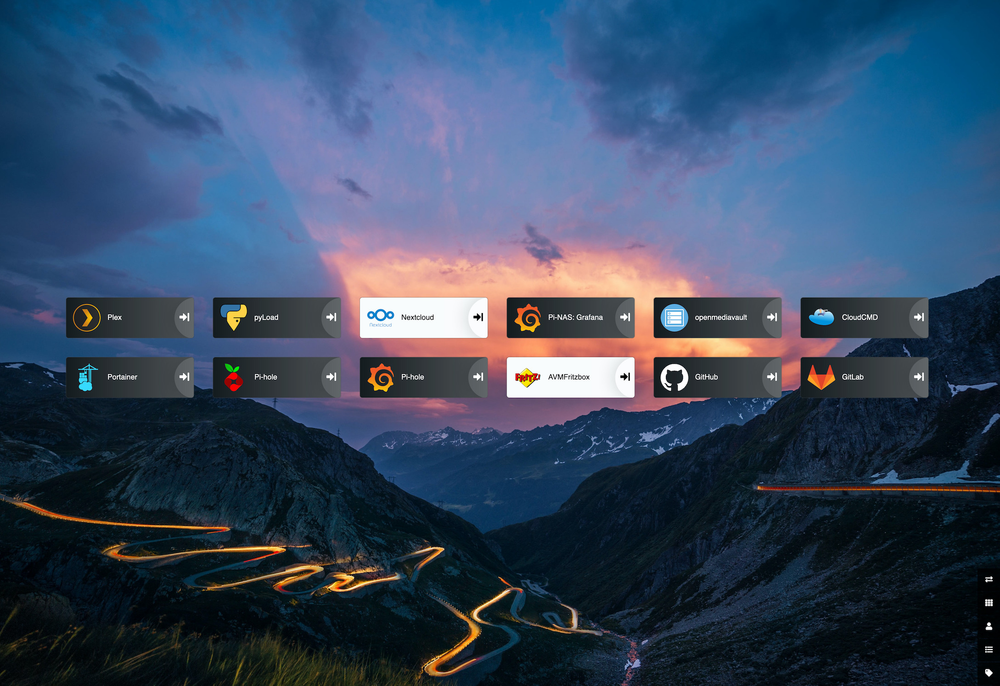
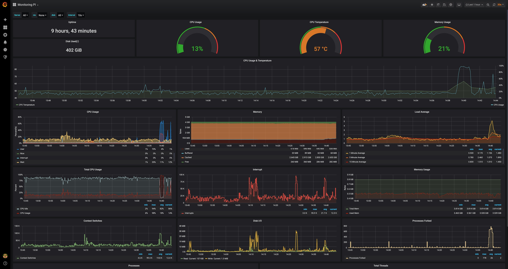

# Raspberry PI NAS

Setup your own NAS on a Raspberry Pi.

## Preview

### Dashboard



### Monitoring



## Hardware

- [Raspberry Pi 4 4GB](https://www.raspberrypi.com/products/raspberry-pi-4-model-b/)
- [SD Card 32GB (Silicon Power)](https://www.amazon.de/dp/B07RMXNLF4?psc=1&ref=ppx_yo2ov_dt_b_product_details)
- [QNAP TR-004 RAID Storage (RAID 5)](https://www.qnap.com/en-us/product/tr-004)
- [SEAGATE IronWolf 4TB (ST4000VN006)](https://www.seagate.com/de/de/products/nas-drives/ironwolf-hard-drive/)

If you want to use a software based RAID setup instead, you need to format your drives first. You can use the following guides to setup a RAID 5 with Btfs:

- [RAID 5 with Btfs](https://archive.kernel.org/oldwiki/btrfs.wiki.kernel.org/index.php/Using_Btrfs_with_Multiple_Devices.html#)
- [New documentation](https://btrfs.readthedocs.io/en/latest/mkfs.btrfs.html#multiple-devices)

## OS

- 64 bit Raspbian
- Vanilla Rasbperry Pi OS Bullseye (e.g. Raspberry Pi OS LITE 64 bit) [Installation guide](https://www.raspberrypi.com/software/)

### SSH

More documentation to [enable SSH](https://www.raspberrypi.org/documentation/remote-access/ssh/README.md) or [generate Keys](https://www.raspberrypi.org/documentation/remote-access/ssh/passwordless.md).

```bash
# Enable SSH
sudo systemctl enable ssh
sudo systemctl start ssh

# SSH Keys
ssh-keygen -t rsa -b 4096 -C
```

## SMB Shares

### Format Drives

```bash
# List Disks
sudo fdisk -l

# Open Disk (replace X with the disk letter)
sudo fdisk /dev/sdX 

# Create Partititon
n
default
default
default
w

# Check Table
sudo fdisk -l

# Format the partition (replace X with the disk letter)
sudo mkfs -t ext4 /dev/sdX1
```

More documentation can be found [here](https://phoenixnap.com/kb/linux-create-partition).

### Mount Drives

#### Prepare Disks

In order to identify the disks with a descriptive name, we need to add a label to the disks. This can be done with the following commands.

```bash
# List Disks
sudo fdisk -l

# Goal state
# /dev/disk/by-label/qnap (8TB)        | LABEL="qnap"

# Add Label to Disks: (replace X with the disk letter)
sudo e2label /dev/sdX1 qnap
```

#### Mount Disks manually

```bash
# Create Mount Points
sudo mkdir /mnt/qnap

# Check Permissions
stat /mnt/qnap

# Change Owner (replace $USER with your username)
sudo chown -R $USER:users /mnt/qnap/*

# Change Permissions
chmod -R 775 /mnt/qnap/*

# Mount Disks
mount /dev/disk/by-label/qnap /mnt/qnap/

# (Optional) Mount Disks with User Permissions
mount -o user=$USER /dev/disk/by-label/qnap /mnt/qnap/
```

More documentation can be found [here](https://linuxhint.com/mount_usb_drive_debian/).

#### Mount Disks automatically

```bash
# Identify UUIDs or Labels of the disks
sudo blkid
# Edit /etc/fstab
sudo nano /etc/fstab
# Add the following lines to /etc/fstab
LABEL=qnap /mnt/qnap ext4 nofail,x-systemd.device-timeout=1ms 0 0
```

More documentation can be found [here](https://raspberrypi-guide.github.io/filesharing/mounting-external-drive#set-up-automatic-mounting).


### Setup SMB Server

```bash
sudo apt-get update
sudo apt-get upgrade

# Install Samba
sudo apt-get install samba samba-common-bin

# Setup Shares
sudo nano /etc/samba/smb.conf

# Add Configuration to smb.conf (replace $USER with your username)
[nas]
    path = /mnt/qnap/nas
    writeable = Yes
    create mask = 0775
    directory mask = 0775
    public = no
    force user = $USER
    force group = $USER

[timemachine]
    path = /mnt/qnap/timemachine
    writeable = Yes
    vfs objects = catia fruit streams_xattr
    fruit:time machine = yes
    public = no

# Setup SMB User (replace $USER with your username)
sudo smbpasswd -a $USER

# Restart Samba service
sudo systemctl restart smbd
```

More documentation can be found [here](https://pimylifeup.com/raspberry-pi-samba/) and [here](https://www.jeffgeerling.com/blog/2021/htgwa-create-samba-smb-share-on-raspberry-pi).

### Setup TimeMachine Share

```bash
sudo nano /etc/avahi/services/samba.service

# Add Configuration to samba.service
  <?xml version="1.0" standalone='no'?><!--*-nxml-*-->
  <!DOCTYPE service-group SYSTEM "avahi-service.dtd">
  <service-group>
    <name replace-wildcards="yes">%h</name>
    <service>
      <type>_smb._tcp</type>
      <port>445</port>
    </service>
    <service>
      <type>_device-info._tcp</type>
      <port>9</port>
      <txt-record>model=Xserve1,1</txt-record>
    </service>
    <service>
      <type>_adisk._tcp</type>
      <port>9</port>
      <txt-record>dk0=adVN=timemachine,adVF=0x82</txt-record>
      <txt-record>sys=adVF=0x100</txt-record>
    </service>
  </service-group>

# Restart Avahi service
sudo systemctl restart avahi-daemon
```

More documentation can be found [here](https://ovechkin.xyz/blog/2021-12-13-using-raspberry-pi-for-time-machine). After modifying the samba.service file, the TimeMachine share should be visible in the Finder.

### Other useful things

#### HDD Spin Down Times

```bash
# Install hd-idle
sudo apt install hd-idle
# Configure hd-idle
sudo nano /etc/default/hd-idle

# Change line according to your available disks. Replace X with the disk letter.
# The following line will set the default to 0 and the custom idle time for disk sdX to 8 minutes. Save File afterwards.
HD_IDLE_OPTS="-i 0 -a sdX -i 480 -l /var/log/hd-idle.log"

# Restart hd-idle
sudo systemctl restart hd-idle

# Check if hd-idle is running
systemctl status hd-idle
```

More documentation can be found [here](https://www.htpcguides.com/spin-down-and-manage-hard-drive-power-on-raspberry-pi/)

#### Log2Ram

```bash
sudo apt update
sudo apt install log2ram

# Check if log2ram is running (after reboot!)
systemctl status log2ram
```

More documentation can be found [here](https://github.com/azlux/log2ram).

#### Check Disk Utilization

```bash
df -h
```

## Docker Setup

### Install Docker

I recommend to install it yourself following a simple [guide](https://dev.to/rohansawant/installing-docker-and-docker-compose-on-the-raspberry-pi-in-5-simple-steps-3mgl).

### Prepare Docker Environment

All following commands need to be run from your Raspberry PI. Either connect via `SSH` or direct access.

#### 1. Clone Repository

```bash
git clone https://github.com/timoknapp/rpi-nas.git
cd rpi-nas
```

#### 2. Configure your Setup

Replace Placeholders in `docker-compose.yml` file:

- ${PATH_TO_DISK} with related Path on your PI
- Execute the following command on your PI:  ``id `whoami` ``
  - Replace ${USER_ID} with the integer value of `uid`.
  - Replace ${GROUP_ID} with the integer value of `gid`.

- Set password `postgres` user

#### 3. Run Compose-Stack

```bash
docker-compose up
```

#### 4. Try it out

Opening a browser with the IP of your PI should show now the Heimdall dashboard. A configured dashboard would like like one on top. (e.g. `http://IP-OF-YOUR-PI`)

### Components

Following show all the applications of the `docker-compose.yml` related to their exposed ports on the host.

| Application | Port | URL | Optional |
| ------------| ---- | --- | -------- |
| [Portainer](https://github.com/portainer/portainer) | 9000 | http://localhost:9000 | |
| [Heimdall Dashboard](https://github.com/linuxserver/Heimdall) | 80, 443 | http://localhost, https://localhost | |
| [Pi-hole](https://github.com/pi-hole/docker-pi-hole) | 53, 8080 | http://localhost:8080 | |
| [Homebridge](https://github.com/homebridge/homebridge) | 8581 | http://localhost:8581 | |
| [Deconz Conbee](https://github.com/deconz-community/deconz-docker) | 8888, 8443 | http://localhost:8888, https://localhost:8443 | |
| [Plex](https://github.com/linuxserver/docker-plex) | 32400 | http://localhost:32400/web/index.html | yes |
| [CloudCmd](https://github.com/coderaiser/cloudcmd) | 8008 | http://localhost:8008 | yes |
| [pyLoad](https://github.com/linuxserver/docker-pyload) | 8088 | http://localhost:8088 | |
| [Nextcloud](https://github.com/nextcloud/server) | 8081 | http://localhost:8081 | yes |
| [Home-Assistant](https://github.com/home-assistant/core)(1) | 8123 | http://localhost:8123 | yes |
| [Grafana](https://github.com/grafana/grafana) | 3000 | http://localhost:3000 <br>runs in influx network | |
| [InfluxDB](https://github.com/influxdata/influxdb) | - | runs in influx network | |
| [Telegraf](https://github.com/influxdata/telegraf) | - | runs in influx network | |
| [Internet Speedtest](https://github.com/kjake/internet-speedtest-docker) | - | runs in influx network | yes |

Optional means that the application is not necessary for the NAS to work properly. It is just a nice to have. If you want to use it, you need to uncomment the related lines in the `docker-compose.yml` file.

(1) In order to expose your external devices using Zigbee/Z-Wave dongles to the Home Assistant container, you can read this [guide](https://www.home-assistant.io/docs/installation/docker/#exposing-devices)

## CloudflareD

Tdb.
