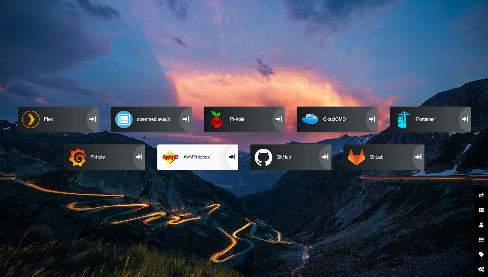

# Raspberry PI NAS
Setup your own NAS on a Raspberry Pi



## Prerequisite
- OpenMediaVault (if wanted) [here](https://www.openmediavault.org/)
- Docker

## Install openmediavault

Either you install a Debian Linux or directy install the `openmediavault`
image following the corresponding [installation guide](https://openmediavault.readthedocs.io/en/latest/installation/index.html).

## Install Docker

Usually Docker can installed through `openmediavault`, but sometimes there are issues during the setup. Therefore I recommend to install it yourself following a simple [guide](https://dev.to/rohansawant/installing-docker-and-docker-compose-on-the-raspberry-pi-in-5-simple-steps-3mgl).

## Getting Started
All following commands need to be run from your Raspberry PI. Either connect via `SSH` or direct access.

### 1. Clone Repository
```
git pull https://github.com/tea-mo903/rpi-nas.git
cd rpi-nas
```


### 2. Configure your Setup
Replace Placeholders in docker-compose file:
- ${PATH_TO_DISK} with related Path on your PI
- Execute the following command on your PI:  ``id `whoami` ``
    - Replace ${USER_ID} with the integer value of `uid`.
    - Replace ${GROUP_ID} with the integer value of `gid`.

- Set password `postgres` user

### 3. Run Compose-Stack
```
docker-compose up
```

### 4. Try it out
Opening a browser with the IP of your PI should show now the Heimdall dashboard. A configured dashboard would like like one on top. (e.g. `http://IP-OF-YOUR-PI`)

## Components
Following show all the applications of the `docker-compose.yml` related to their exposed ports on the host.

| Application | Port | URL |
| ------------| ---- | --- |
| [Heimdall Dashboard](https://github.com/linuxserver/Heimdall) | 80, 443 | http://localhost, https://localhost |
| [Plex](https://github.com/linuxserver/docker-plex) | 32400 | http://localhost:32400/web/index.html |
| [Portainer](https://github.com/portainer/portainer) | 9000 | http://localhost:9000 |
| [CloudCmd](https://github.com/coderaiser/cloudcmd) | 8008 | http://localhost:8008 |
| [pyLoad](https://github.com/linuxserver/docker-pyload) | 8088 | http://localhost:8088 |
| [Nextcloud](https://github.com/nextcloud/server) | 8081 | http://localhost:8081 |
| [Home-Assistant](https://github.com/home-assistant/core) | 8123 | http://localhost:8123 |
| [Grafana](https://github.com/grafana/grafana) | 3000 | http://localhost:3000 <br>runs in influx network |
| [InfluxDB](https://github.com/influxdata/influxdb) | - | runs in influx network |
| [Telegraf](https://github.com/influxdata/telegraf) | - | runs in influx network |

## Contributing
Feel free to modify, add, fork: [simply](CONTRIBUTING.md)
